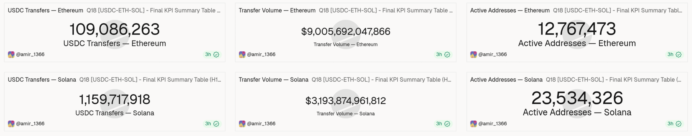
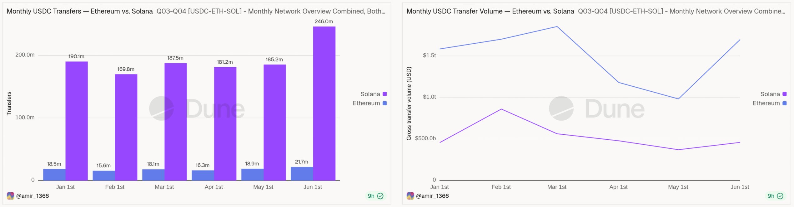
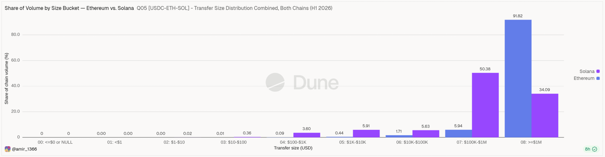
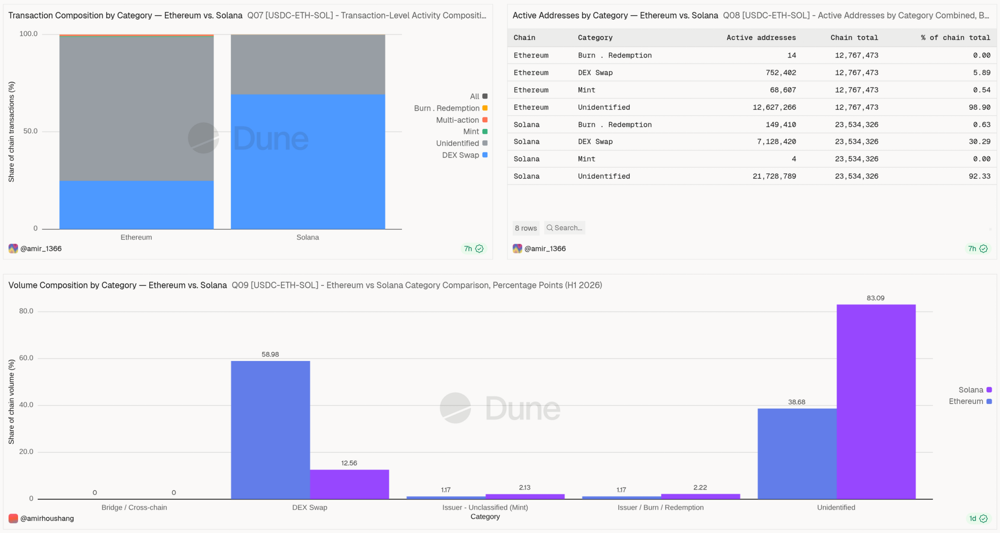
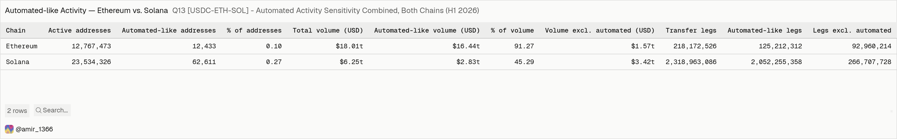

# USDC on Ethereum vs. Solana — H1 2026

An on-chain comparison of how native USDC was actually used on Ethereum and Solana between 1 January and 30 June 2026, built entirely in Dune SQL.

**Live dashboard:** https://dune.com/amirhoushang/usdc-on-ethereum-vs-solana-h1-2026

---

## Executive summary

Solana processed 1,159,717,918 USDC transfers against Ethereum's 109,086,263 — 10.63 times as many — while Ethereum moved 2.82 times the value, $9,005,692,047,865.85 against $3,193,874,961,811.63.

On Ethereum, 91.82% of all transferred value sat in transfers of $1 million and above; on Solana the largest single band was $100,000 to $1 million with 50.38%, and the $1 million band held 34.09%.

DEX swaps accounted for 69.22% of Solana's USDC transactions but only 12.56% of its transferred value, while on Ethereum swaps were 24.83% of transactions and 58.97% of value — the same asset doing two different jobs.

Value is far more concentrated on Ethereum: a single address moved 32.96% of all USDC volume and the ten largest moved 67.89%, against 7.01% and 17.35% on Solana.

On Ethereum, 12,433 addresses — 0.0974% of all active addresses — produced 91.27% of the volume; on Solana 62,611 addresses (0.2660%) produced 45.29%.

---

## Research question

How did native USDC usage differ between Ethereum and Solana in the first half of 2026, measured by transfer activity, active addresses, transfer size, activity category, address concentration, automated activity, wallet-level net flows and short-term holding behaviour?

Sub-questions, each answered by one section of the dashboard:

| # | Question | Dashboard section |
| --- | --- | --- |
| T1 | How much USDC activity did each chain carry, and how did it develop monthly? | 1 Overview |
| T2 | How large is a typical transfer, and where does the value actually sit? | 2 Transfer Size Distribution |
| T3 | What is the USDC being used for on each chain? | 3 Category Composition |
| T4 | Which DEX protocols dominate, and how does issuance develop? | 4 Protocols and Issuer Trend |
| T5 | How concentrated is activity on a few addresses? | 5 Address Concentration |
| T6 | How much of the activity is machine-driven, and who are the unlabelled counterparties? | 6 Automated Activity |
| T7 | Which wallets accumulated and which drained USDC? | 7 Wallet-Level Net Flows |
| T8 | Is USDC held between trades, and for how long? | 8 Parking and Settlement Sequences |
| T9 | Is the underlying data clean enough to support all of the above? | 9 Summary and Data Quality |

---

## Scope

Native USDC only, Ethereum mainnet and Solana, 1 January to 30 June 2026 UTC.

Bridged USDC variants on Solana were measured before the analysis and found immaterial — 3,990 transfers and $847,005.12 against 190,054,688 native transfers and $457,408,009,646.09 in January alone, which is 0.0021% of the native transfer count and 0.00019% of the native volume. They are excluded.

**Explicitly not covered:** other chains, Layer 2 networks, centralised exchange internal ledgers, interest rates or yield, total value locked, address balances, price effects, USDC competitors, and any causal claim about why the two chains differ. The analysis describes what happened on-chain; it does not explain why.

---

## Data sources

Four public Dune curated tables, no gated datasets:

| Table | Used for |
| --- | --- |
| `tokens.transfers` | Ethereum transfer counts, volume, addresses, size distribution |
| `tokens_solana.transfers` | the same on Solana |
| `dex.trades` | Ethereum DEX classification, protocols, parking sequences |
| `dex_solana.trades` | the same on Solana |

Contract address on Ethereum: `0xa0b86991c6218b36c1d19d4a2e9eb0ce3606eb48`. Mint address on Solana: `EPjFWdd5AufqSSqeM2qN1xzybapC8G4wEGGkZwyTDt1v`.

---

## Queries

No SQL files or CSV exports are committed to this repository. Every query is public on Dune, and every number on the dashboard can be traced to one of them — open the query, read the SQL, see the result. That is a stronger proof than a copy of the code sitting in a repository.

These sixteen queries feed the dashboard:

| Query | Dune |
| --- | --- |
| Q02 Data quality check | https://dune.com/queries/8808858 |
| Q03-Q04 Monthly network overview, both chains | https://dune.com/queries/8815962 |
| Q05 Transfer size distribution, both chains | https://dune.com/queries/8816422 |
| Q06 Transfer classification, both chains | https://dune.com/queries/8816772 |
| Q07 Transaction-level composition with shares | https://dune.com/queries/8817056 |
| Q08 Active addresses by category, both chains | https://dune.com/queries/8817422 |
| Q09 Category comparison in percentage points | https://dune.com/queries/8804845 |
| Q10-ETH Top DEX protocols, Ethereum | https://dune.com/queries/8818578 |
| Q10-SOL Top DEX protocols, Solana | https://dune.com/queries/8818586 |
| Q11 Issuer monthly trend, both chains | https://dune.com/queries/8818721 |
| Q12 Address concentration, both chains | https://dune.com/queries/8819066 |
| Q13 Automated activity sensitivity, both chains | https://dune.com/queries/8819202 |
| Q14 Unidentified top counterparties, both chains | https://dune.com/queries/8819516 |
| Q15 Wallet-level net flows, both chains | https://dune.com/queries/8819754 |
| Q17 Parking duration and re-entry rate | https://dune.com/queries/8808809 |
| Q18 Final KPI summary table | https://dune.com/queries/8819655 |

Several of these are presentation queries: they carry the already computed results of the heavy queries as literal values, so that Ethereum and Solana can appear side by side in one widget — which Dune cannot do from two separate queries. Each names its source queries in the SQL header comment, and the complete query list, including every failed and superseded attempt, is in [docs/methodology.md](docs/methodology.md).

---

## Key findings

### Ten times the transfers, a third of the value

Solana carried 10.63 times Ethereum's transfer count and 35.47% of its value. The pattern holds every single month: Solana's transfer count never drops below 169.8 million, Ethereum's never rises above 21.7 million, while Ethereum's monthly volume stays above Solana's throughout.

### Small transfers move almost nothing

Transfers below $1,000 are 75.90% of all Ethereum transfers and carry 0.0976% of the volume. On Solana they are 92.47% of transfers and 3.9888% of volume. (These figures exclude the separate bucket for transfers with a zero or missing USD value — 6.81% of Ethereum transfers, 0.53% of Solana transfers.)

The median transfer sits in the $10–$100 band on both chains, but the value does not: on Ethereum 91.82% of all volume is in transfers of $1 million and above, while Solana's largest band is $100,000–$1 million at 50.38%.

### The category split is inverted between the two measures

Counted by transaction, Solana is a swap chain: 69.22% DEX swaps against Ethereum's 24.83%. Counted by value, it is the opposite: those Solana swaps carry 12.56% of the volume while Ethereum's carry 58.97%.

Counted by address, the picture shifts again — 30.29% of Solana's active addresses touched a DEX swap, against 5.89% on Ethereum.

### Concentration runs in opposite directions

Ethereum's **value** is concentrated: the single largest address moved 32.96% of all sent volume, the top 10 moved 67.89%, the top 100 moved 84.85%. On Solana the same figures are 7.01%, 17.35% and 38.66%.

Solana's **activity** is the more concentrated one: its top 100 addresses account for 45.62% of all transfer legs, against 29.05% on Ethereum.

### A tiny automated minority dominates Ethereum's volume

12,433 Ethereum addresses — 0.0974% of all active addresses — account for 91.27% of the volume and 57.39% of all transfer legs. On Solana the automated-like group is larger in relative terms (62,611 addresses, 0.2660%) and produces 88.50% of all transfer legs, but only 45.29% of the volume. Automation dominates *value* on Ethereum and *frequency* on Solana.

### Issuance is stable, redemption tracks it

Across the six months, Ethereum mint volume moved between $15.85bn and $18.15bn (a factor of 1.14 between the lowest and highest month) and burn volume between $13.51bn and $20.92bn (factor 1.55). On Solana, mint ranged $9.78bn–$12.70bn (factor 1.30) and burn $10.12bn–$14.31bn (factor 1.41). Half-year totals: Ethereum $104.95bn minted against $105.78bn burned, Solana $68.00bn against $70.88bn. No month shows a supply shock on either chain.

On the address side, issuer activity is run by almost nobody: 14 Ethereum addresses and 4 Solana addresses appear on the mint or burn side in the entire period.

### USDC is held only briefly between trades

Among candidate trading wallets, 84.46% of Ethereum parking sequences and 71.72% of Solana ones end in a re-entry. Of those re-entries, 85.65% happen within one hour on Ethereum and 99.38% on Solana. Total parked value: $17.19bn across 3,527,079 Ethereum sequences and $58.50bn across 126,097,891 Solana sequences.

This section describes a candidate population dominated by high-frequency, automated-like trading, not typical users. See [docs/limitations.md](docs/limitations.md).

### The data is clean

Zero duplicate rows and zero rows with a USD value deviating more than 1% from the token amount, on both chains, across all 1,268,804,181 transfer rows.

---

## Documentation

| File | Content |
| --- | --- |
| [docs/methodology.md](docs/methodology.md) | definitions, classification logic, the complete query list including failures, and why some queries are literal-value presentation layers |
| [docs/limitations.md](docs/limitations.md) | what these numbers cannot tell you, and where the data itself is incomplete |
| [report/findings.md](report/findings.md) | every figure, section by section |

---

## If you want to reproduce or fork this

**Read this before you run anything.** This project is expensive. It consumed the query credits of a paid main account and three further accounts before it was finished.

**Solana is the cost driver.** `tokens_solana.transfers` holds over a billion rows for this period alone, and `dex_solana.trades` is in the hundreds of millions. An anti-join between the two over six months is the single most expensive operation here, and it exhausted several accounts.

**Start on a small time window.** Fork a query, set the date filter to a single month or a single week, confirm the output shape is what you expect, and only then widen it. The Ethereum queries are cheap enough to run on the full period directly; the Solana ones are not.

**Use the Large engine for the heavy queries from the first attempt.** This is counter-intuitive, because Large costs more per run. But a Small-engine run that times out after two minutes has already cost credits and produced nothing, and you will then repeat it on Medium and again on Large — three runs instead of one. For anything touching `tokens_solana.transfers` joined against `dex_solana.trades`, go straight to Large.

**Query composition is not caching.** `FROM query_XXXXXXX` does not reuse a stored result. Dune re-executes the upstream query in full on every run, as a functional SQL view. An aggregation query built on top of two expensive queries is not cheap — it is both of them, again. This cost a lot of credits before it was understood. Q07 (8804598) and Q09 (8804845) contain such references and should not be re-run.

**Do not re-run what already has a result.** Dune keeps the last execution and the dashboard displays it. Clicking Run on a finished query buys nothing.

---

## How this project was built

This section is here because the process is part of the work, and because anyone reproducing it should know what they are walking into.

**Four Dune accounts.** The main account is paid, and it was still not enough to finish the project there. Query credits ran out mid-analysis, and the work continued on a second, then a third, then a fourth account. The consequence is visible on the dashboard: the widgets are served by queries published under @amir_1366 while the dashboard itself lives on @amirhoushang. This is not several people — it is one person and four credit budgets.

**The query history is kept on purpose.** Failed attempts, timed-out variants, single-month test runs and superseded versions were not deleted. They show how the analysis actually developed: which schema assumptions turned out to be wrong, which joins were too expensive, which queries had to be split into stages. A tidy list of ten perfect queries would be a less honest description of this work than the messy list that exists.

**Claude was used throughout, and this project would not exist without it.** The SQL was written with it, the classification logic was worked out with it, and several genuine bugs were caught by it. That should be said plainly rather than hidden.

It should also be said plainly where that help had to be corrected, because anyone doing the same thing will hit the same points.

*It gives up early.* Repeatedly, a query was declared impossible or too expensive when a solution did exist. Once it became clear how many credits had already been burned, this got worse — the suggestions moved towards making everything smaller, simpler and shallower instead of solving the actual problem. Several of the more interesting results here exist because that advice was rejected and the problem was worked through anyway.

*It has to be told to read the documentation.* Left alone, it proposes a plausible-looking query from memory. Asked directly to check the Dune documentation first, it finds the real answer: the correct column names, the partition keys, the documented efficient-query patterns, the fact that query composition re-executes. Three separate blockers in this project were resolved only after insisting on the documentation.

*Its default working style is wrong for a credit-metered database.* It suggests frequent intermediate checks and small test queries. That is good advice in most contexts and bad advice here, because every test run costs credits. Testing was deliberately cut back to the points where something was genuinely unknown.

*It produces errors and repeats itself.* Wrong column names, a spurious data-quality finding caused by comparing two columns with different scaling, and inconsistent formatting instructions all occurred and had to be caught. Not every suggestion should be accepted.

**Feedback is welcome.** If you spot a mistake, tell me. To be clear about the kind of feedback that helps most: I am confident in the numbers, because each one traces to a public query you can open and read, and the internal cross-checks are documented in the methodology. What I am less sure about is whether some of the SQL became more complicated than it needed to be along the way. If you see a simpler path to the same result, I would like to hear it.

---

## Author

Amir Houschang — Dune: [@amirhoushang](https://dune.com/amirhoushang)
